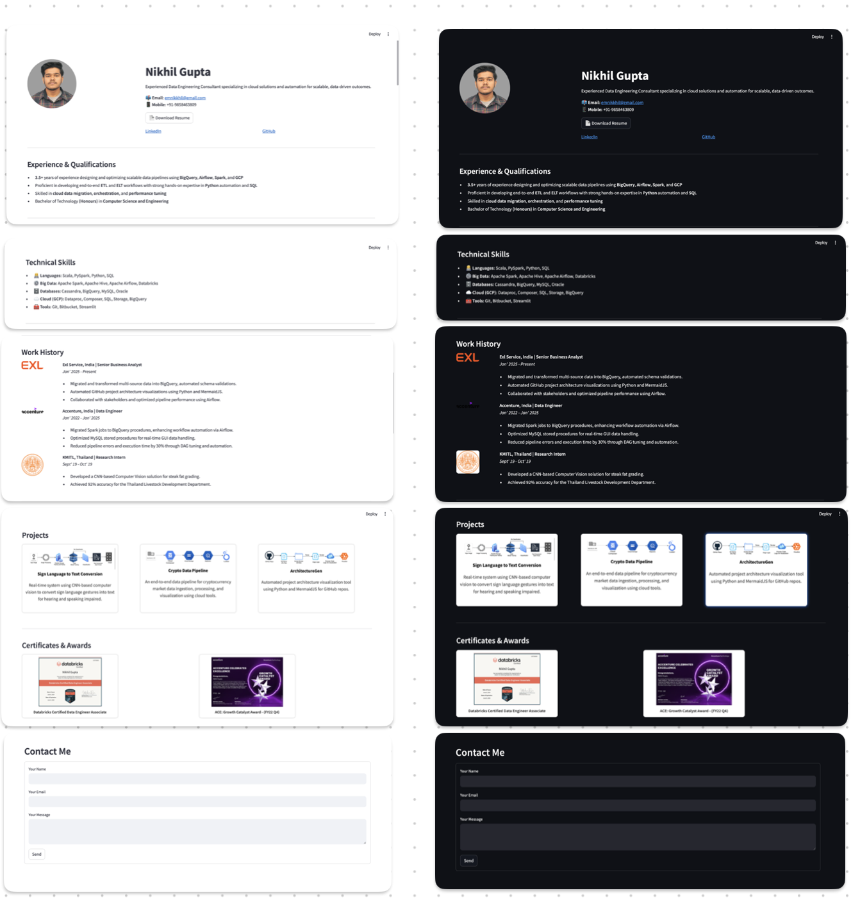

# Digital CV

A personal digital resume and portfolio web application built with Streamlit, designed to elegantly showcase skills, professional experience, projects, and certificates. It also features an integrated contact form for direct communication via email.



---

## Features

- Clean, responsive design with seamless dark mode support
- Dedicated sections for Experience, Skills, Work History, Projects, and Certificates
- Integrated contact form with email sending capability
- Easily customizable and extensible for personal or professional use

---

## Getting Started

### Prerequisites

- Python 3.7 or higher
- pip package manager
- streamlit : ```pip install streamlit```

### Steps to Use

## 1. Clone the repository

```bash
git clone https://github.com/yourusername/Digital-CV.git
cd Digital-CV
```
## 2. Replace assets and photos
   
Update the images and certificates inside the assets/ folder with your own files.

## 3. Update your details
   
Modify the Python files inside the ```sections/``` directory to update your personal information, skills, experience, projects, and certificates.
Update ```config.py``` with your project, work history and certificate details.

## 4. Steps to implement email sending with your contact form:

- Setup: Allow Gmail SMTP access  
- Use a Gmail account to send emails.  
- Create an App Password (recommended) if you have 2FA enabled on your Google account:
   
       https://support.google.com/accounts/answer/185833    
   
  Or allow "Less secure app access" (not recommended).

## 5. Configure email for contact form
   
Create ```.streamlit/secrets.toml``` file with your email credentials for the contact form to work:

```
[email]
address = "your.email@example.com"
password = "your_email_password"
```

## 6. Run the app on local

```
python -u portfolio/app.py

streamlit run app.py
```

OR - if Python not added to ```PATH```

```
python3 -u portfolio/app.py

python3 -m streamlit run app.py
```

## 7. Open in your browser
   
Visit ```http://localhost:8501``` (or the URL Streamlit provides) to see your digital CV in action.

## 8. Prevent Streamlit app from going to sleep

Steps:

- In your forked repository, go to .github/workflows/keep_alive.yml
- Replace the placeholder app ```URL``` with your actual ```Streamlit app URL```

```yaml
name: Keep Streamlit App Awake

on:
  schedule:
    - cron: '0 */3 * * *'

jobs:
  keep-alive:
    runs-on: ubuntu-latest
    steps:
      - name: Curl your Streamlit app
        run: curl -s --head https://nikhilgupta.streamlit.app || true
```

# Project Structure

```
Digital-CV/
├── .devcontainer/             # Dev container config
│   └── devcontainer.json      # (for Codespaces / VS Code Remote Containers)
│
├── .github/                   # GitHub Actions workflows
│ └── workflows/
│ └── keep_alive.yml           # Keeps Streamlit app awake using scheduled pings
|
├── assets/                    # Static assets like resume and photos
│   ├── Resume.pdf
│   └── photos/
│       ├── photo1.png
│       └── photo2.jpg
│
├── sections/                  # Streamlit modular UI components
│   ├── header.py
│   ├── experience.py
│   ├── skills.py
│   ├── work_history.py
│   ├── projects.py
│   ├── certificates.py
│   └── contact.py
│
├── styles/                    # Custom CSS files
│   └── main.css
│
├── .gitignore                 # Git ignore rules (include .streamlit/)
├── .streamlit/                # 🔒 Sensitive info (DO NOT push to GitHub)
│   └── secrets.toml           # Streamlit secrets (kept local only)
├── LICENSE                    # Project license
├── README.md                  # Project documentation
├── app.py                     # Main Streamlit app
├── config.py                  # App configuration and constants
├── helpers.py                 # Utility/helper functions
└── requirements.txt           # Python dependencies
```